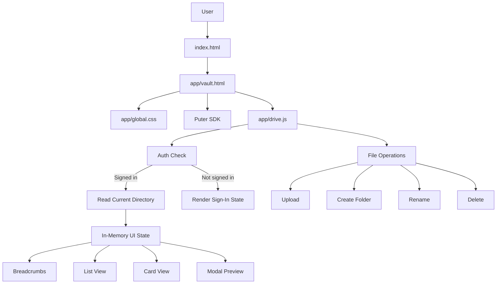
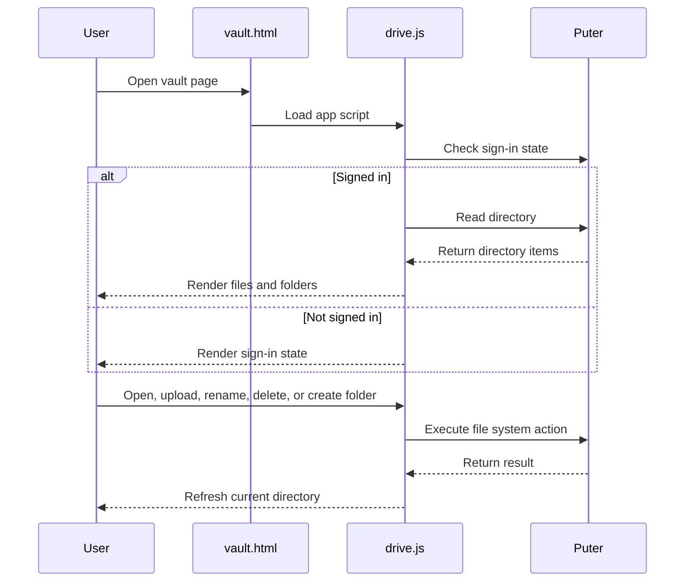

<p align="center">
  
</p>

# TW Drive

**Privacy-first file storage and private folder access** — a static landing page and vault UI for browsing folders, managing files, and previewing content in the browser.

---

## Table of contents

- [Overview](#-overview)
- [Key features](#-key-features)
- [Entry points](#-entry-points)
- [Tech stack](#-tech-stack)
- [Getting started](#-getting-started)
- [Scripts](#-available-scripts)
- [Project structure](#-project-structure)
- [File guide](#-file-guide)
- [Architecture](#-architecture)
- [Puter integration](#-puter-integration)
- [Development notes](#-development-notes)

---

## Overview

| Part | Description |
|------|-------------|
| **Landing page** | Product positioning, SEO, and primary CTA into the vault |
| **Vault** | File and folder browser with search, upload, rename, delete, and previews |

The **file system and authentication** are provided by the [Puter](https://puter.com) JavaScript SDK.

---

## Key features

| Feature | Description |
|--------|-------------|
| Privacy-first landing | Dark theme, SEO-focused copy, single CTA to vault |
| Vault UI | Breadcrumb navigation, list & card views, search in current directory |
| File operations | Upload, create folder, rename, delete |
| Previews | Images (jpg, png, gif, webp, bmp, svg) and text-like files (txt, md, json, js, css, html, log) |
| Persistence | View mode (list/cards) stored in `localStorage` |

---

## Entry points

| Route | File | Purpose |
|-------|------|---------|
| `/` | `index.html` | Public landing page |
| `/app/vault.html` | `app/vault.html` | Interactive vault UI |

---

## Tech stack

| Layer | Technology |
|-------|------------|
| Markup | HTML |
| Logic | Vanilla JavaScript (no framework) |
| Styles | Tailwind CSS v4 |
| Backend / auth | Puter SDK |

---

## Getting started

### Prerequisites

- **Node.js** (for npm and Tailwind build)
- **Browser**
- **Puter account** (for file operations in the vault)

### Installation

```bash
npm install
```

### Build CSS

```bash
npm run build
```

### Run locally

```bash
npx serve .
```

Then open:

- **Landing:** [http://localhost:3000/](http://localhost:3000/)
- **Vault:** [http://localhost:3000/app/vault.html](http://localhost:3000/app/vault.html)

---

## Available scripts

| Command | Description |
|---------|-------------|
| `npm run build:css` | Compile Tailwind → `app/global.css` |
| `npm run watch:css` | Watch and rebuild CSS on change |
| `npm run build` | Same as `build:css` |

---

## Project structure

```
.
├── index.html          # Landing page
├── app/
│   ├── vault.html      # Vault UI
│   ├── drive.js        # Vault logic (Puter, UI, modals)
│   └── global.css      # Generated Tailwind output
├── tw-source.css       # Tailwind entry + theme + @source
├── package.json
└── README.md
```

---

## File guide

| File | Role |
|------|------|
| **`index.html`** | Landing: branding, meta/SEO, hero, privacy/security copy, footer. Single stylesheet: `app/global.css`. |
| **`app/vault.html`** | Vault layout: header, search, view toggle, breadcrumb, content area, modal dialog. Loads Puter SDK and `drive.js`. |
| **`app/drive.js`** | Init, auth check, directory read, list/card render, search, preview, upload, mkdir, rename, delete. |
| **`tw-source.css`** | Tailwind entry: `@import "tailwindcss"`, `@theme` (fonts, drive colors), `@source` for index + vault + drive.js. |
| **`app/global.css`** | **Generated** — do not edit. Consumed by both index and vault. |

---

## Architecture



### Runtime flow



---

## Puter integration

| API | Use |
|-----|-----|
| `puter.auth.isSignedIn()` | Gate vault content vs sign-in message |
| `puter.fs.readdir(path)` | List current directory |
| `puter.fs.stat(path)` | File metadata for preview |
| `puter.fs.read(path)` | File content for preview |
| `puter.fs.upload(files, path)` | Upload into current folder |
| `puter.fs.mkdir(path)` | Create folder |
| `puter.fs.rename(old, new)` | Rename file/folder |
| `puter.fs.delete(path)` | Delete file/folder |

---

## Development notes

- **Frontend-only** — no server-side logic; auth and storage are Puter.
- **Search** is scoped to the current directory only.
- **`app/global.css`** is generated; edit `tw-source.css` and run `npm run build:css`.
- When contributing: keep landing in `index.html`, vault structure in `app/vault.html`, logic in `app/drive.js`; run `npm run build` before pushing.

---

## License

Add a license file before publishing this repository as open source.
